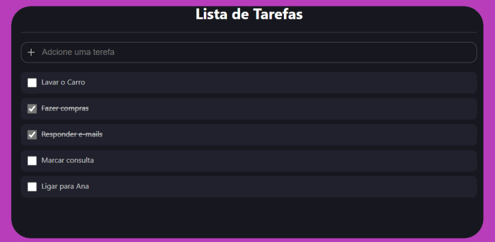

# TS - Lista de Tarefas

  

## 💻 Projeto

O projeto TS - Lista de Tarefas é um web app que permite ao usuário a criação de uma
lista de tarefas para que o mesmo gerencie a execução de suas atividades diárias.
Através de uma caixa de diálogo o usuário poderá digitar uma tarefa que deseja executar e,
ao clicar enter, estas atividades será registrada em uma lisata. Criada a lista, o usuário
é capaz de marcar quais as atividades já foram executadas, dando um check em um box ao lado
da tarefa listada.

## 🚀 Tecnologias

Este projeto foi desenvolvido com as seguintes tecnologias:
- ReactJS;
- TypeScript;
- Styled-Components.