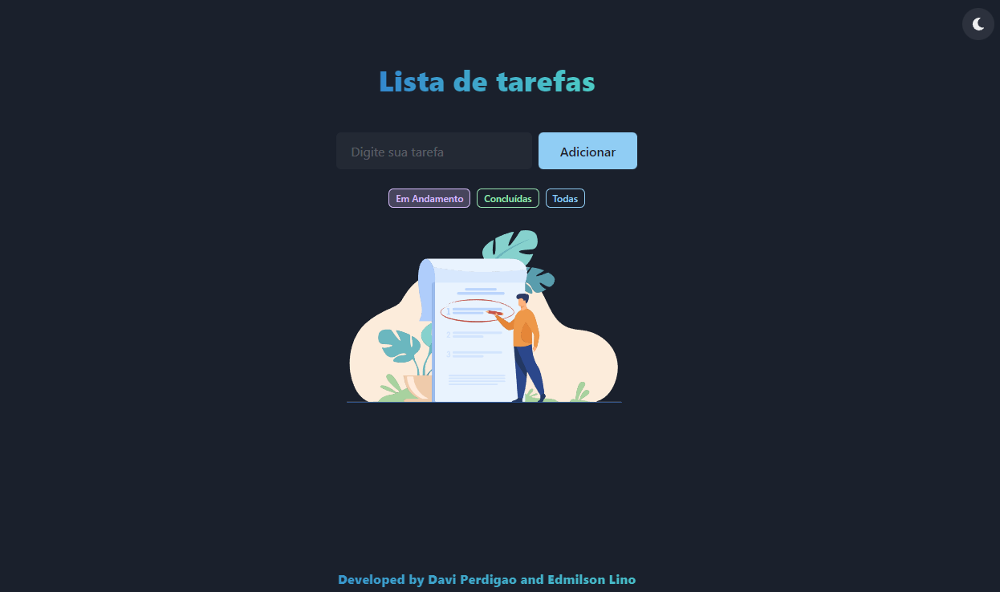

# To-do List TS React
[](https://www.typescriptlang.org/) 
[](https://nodejs.org/en/) 
[](https://pt-br.reactjs.org/) 
[](https://redux.js.org/) 
[](https://react-icons.github.io/react-icons/)

 Uma lista de tarefas simples utilizando algumas das tecnologias mais recentes!

**[CLIQUE AQUI](https://todo.foxtag.com.br/)** para testar (by Vercel)!

 <p align="center">
  <a src="#" target="_blank"></a>
</p>
 
## 👊🏻 Agradecimentos
Esse projeto foi criado utilizando como base 2 projetos distintos, sendo eles:
+ https://github.com/raminhuk/react-todo-list
+ https://github.com/abdulsamadayoade/redux-todo

Utilizando a estrutura REDUX do projeto **redux-todo** e toda parte de layout e estrutura REACT do projeto **react-todo-list**, apenas realizamos a conversão dos projetos para Typescript, unificando ambos em apenas um.

## ❓ Intuito do projeto
O projeto foi criado para fins didáticos. Faz parte de um trabalho proposto na faculdade do curso de Ciências da Computação, que tem como intuito fazer um estudo aprofundado do TypeScript e demonstrar na prática o funcionamento da linguagem,.

## 🚀 Vamos começar
Caso deseje testar esse projeto, siga os passos abaixo:


+ Primeiro clone este repositório 
```jsx
git clone https://github.com/linhous/todo-ts-redux.git
```
+ Entre na pasta todo-ts-redux
```jsx
cd todo-ts-redux
```
+ Execute npm install para instalar as dependências 
```jsx
npm install
```
+ Execute npm run dev para rodar o projeto em http://localhost:3000/
```jsx
npm start
``` 
+ Caso deseje buildar o projeto
```jsx
npm run build
``` 